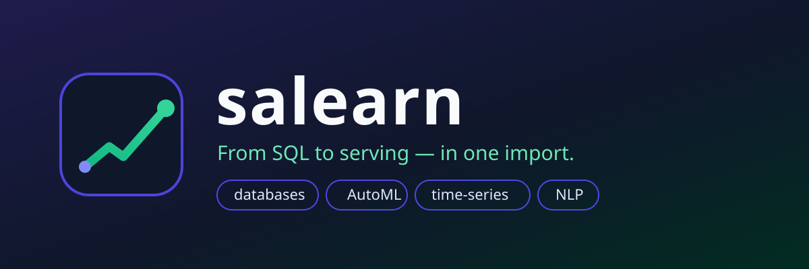
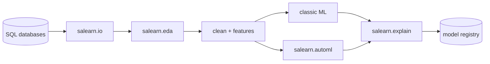

<div align="center">



[](https://pypi.org/project/salearn/)
[](https://www.python.org/)
[](LICENSE)
[](https://github.com/salim-studio/salearn/actions)
[](https://github.com/salim-studio/salearn)

**From SQL to serving — in one import.**

sklearn-compatible and fast (NumPy + optional Numba), with a built-in data stack:
databases · loading · EDA · cleaning · features · time-series · NLP · AutoML · explainability · model registry.

[Quickstart](#quickstart) · [Modules](#module-map) · [Benchmarks](#benchmarks) · [Roadmap](#roadmap) · [Contributing](CONTRIBUTING.md)

</div>

---

## Why salearn?

| You know (sklearn) | You get (salearn) | Speed / extra |
|---|---|---|
| `linear_model` | `salearn.linear_model` | Ridge Cholesky, Lasso-CD (Numba), L-BFGS Logistic |
| `tree` / `ensemble` | `salearn.tree` / `salearn.ensemble` | Vectorized CART, ThreadPool RF/ExtraTrees, GBM, Voting, Stacking |
| `neighbors` / `cluster` | `salearn.neighbors` / `salearn.cluster` | BLAS distances, Numba k-means++ |
| `svm` / `decomposition` / `metrics` / `model_selection` / `pipeline` | same names | Pegasos linear SVM, Nyström approx, full metrics + CV/grid/random search |
| — | `salearn.db` | SQLite / DuckDB / Postgres / MySQL + train straight from SQL |
| — | `salearn.io` `salearn.eda` `salearn.clean` `salearn.features` `salearn.viz` | CSV/Parquet/JSON/URL loading, 1-line profiling + HTML report, dedup/outlier cleaning, target/date encoders |
| — | `salearn.timeseries` `salearn.text` `salearn.automl` `salearn.explain` `salearn.persist` | AR/ETS forecasters, EN+AR TF-IDF, budgeted AutoML, permutation importance, versioned model registry |

> Formerly developed as `sslearn`. The package was renamed to **salearn** for its 1.0 launch — same API, bigger scope.

## Install

```bash
pip install salearn
pip install "salearn[speed]"   # numba — JIT for hot loops
pip install "salearn[db]"      # sqlalchemy + duckdb + pandas + pyarrow
pip install "salearn[eda]"     # pandas + matplotlib
pip install "salearn[all]"     # everything
```

Requires Python 3.9+, `numpy`, `scipy`. Everything else is optional.

## Quickstart

**1. Drop-in sklearn replacement**

```python
# from sklearn.ensemble import RandomForestClassifier
from salearn.ensemble import RandomForestClassifier
from salearn.preprocessing import StandardScaler
from salearn.pipeline import make_pipeline

pipe = make_pipeline(StandardScaler(), RandomForestClassifier(n_estimators=200, n_jobs=-1))
pipe.fit(X_train, y_train)
print(pipe.score(X_test, y_test))
```

**2. Databases — train straight from SQL**

```python
from salearn.db import Database

db = Database.sqlite_file("shop.db")
db.to_sql("sales", df=df, if_exists="replace")
X, y, feats = db.load_X_y("SELECT * FROM sales WHERE amount > 0", target="churn")
model = db.train_sql("SELECT * FROM sales", target="churn")
```

**3. Load → profile → clean in three lines**

```python
from salearn import io, eda
from salearn.clean import DataCleaner

df = io.load_csv("data.csv")                       # or load_parquet / load_url(...)
eda.profile(df, html_path="report.html")           # shape, missing, outliers, duplicates
df = DataCleaner(outlier_clip="iqr").fit_transform(df)
```

**4. Features → AutoML → explain → ship**

```python
from salearn.features import auto_featurize
from salearn.automl import find_best
from salearn.explain import model_report
from salearn.persist import save_model

X, y, names = auto_featurize(df, target="churn", date_cols=["signup_date"])
best, board = find_best(X, y, time_budget=15)
print(board[0], model_report(best, X, y, names))
save_model(best, "churn.ssl")
```

**5. Time-series (NumPy only) and multilingual NLP**

```python
from salearn.timeseries import ARForecaster, temporal_split
train, test = temporal_split(sales, test_size=30)
forecast = ARForecaster(lags=14).fit(train).predict(30)

from salearn.text import TextClassifier   # English + Arabic out of the box
clf = TextClassifier().fit(["great movie", "فيلم رائع", "boring", "ممل"], [1, 1, 0, 0])
clf.predict(["absolutely great", "رائع جدا"])
```

## Module map

```
salearn/
├── linear_model tree ensemble neighbors naive_bayes svm cluster   # classic ML (sklearn API)
├── decomposition metrics model_selection pipeline preprocessing   # ...faster (BLAS / Numba / threads)
├── impute feature_selection mixture neural_network extras datasets calibration
├── db.py          # Database (sqlite/duckdb/postgres/mysql), QueryBuilder, train_sql
├── io.py          # csv/parquet/json/excel/url, chunked reading, to_X_y
├── eda.py         # profile / missing / outliers / correlation / HTML report
├── clean.py       # DataCleaner transformer
├── features.py    # DateFeaturizer, TargetEncoder, FrequencyEncoder, auto_featurize
├── timeseries.py  # Naive / Seasonal / MA / ETS / AR + walk-forward CV
├── text.py        # clean_text, Count/TfidfVectorizer, TextClassifier
├── automl.py      # find_best + leaderboard
├── explain.py     # permutation importance, partial dependence, model_report
├── persist.py     # save_model / load_model / ModelRegistry
└── viz.py         # confusion / residuals / importance (matplotlib optional)
```



## Benchmarks

```bash
python bench/bench.py
python -m pytest -q        # 12 tests, ~20s
python examples_fullstack.py
```

Vectorized NumPy paths (BLAS pairwise distances, Cholesky Ridge, `lstsq`), optional Numba JIT
for KMeans/KNN/SGD/Lasso-CD/Pegasos, and ThreadPool-parallel forests.

## Roadmap

- [ ] PyPI release + docs site
- [ ] Deep-learning bridge (`torch`/`onnx` export)
- [ ] Streaming / incremental estimators
- [ ] More connectors (BigQuery, Snowflake via SQLAlchemy)
- [ ] Multilingual docs (Arabic, French)

Vote with a ⭐ or open an issue — it shapes priorities.

## Contributing

See [CONTRIBUTING.md](CONTRIBUTING.md). Bug reports and PRs welcome.

## License

MIT — see [LICENSE](LICENSE). Changelog in [CHANGELOG.md](CHANGELOG.md).
